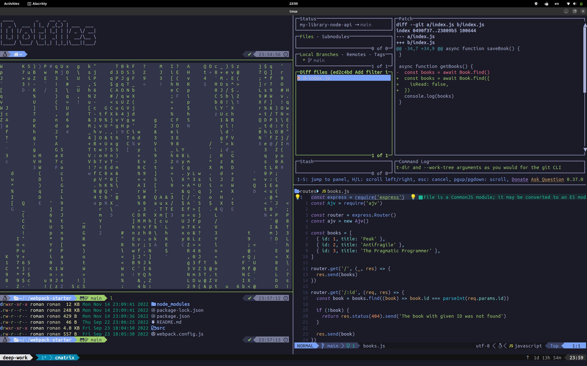

# My dotfiles

## Tmux

- [Tmux Plugin Manager](https://github.com/tmux-plugins/tpm)
- [Vim tmux navigator](https://github.com/christoomey/vim-tmux-navigator) — Seamless navigation between tmux panes and vim splits
- [Tmux resurrect](https://github.com/tmux-plugins/tmux-resurrect) — Persists tmux environment across system restarts
- [Tmux continuum](https://github.com/tmux-plugins/tmux-continuum) — Continuous saving of tmux environment. Automatic restore when tmux is started. Automatic tmux start when computer is turned on
- [Catpuuccin theme](https://github.com/catppuccin/tmux) — Theme for Tmux

## Screenshot

